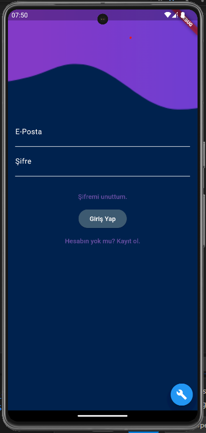
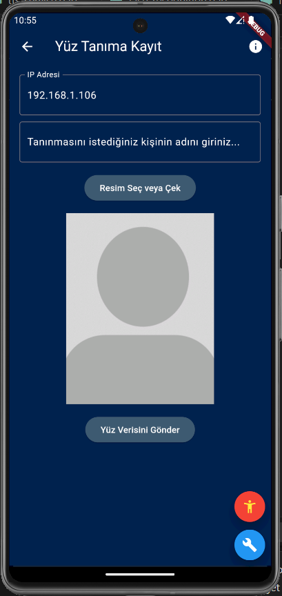
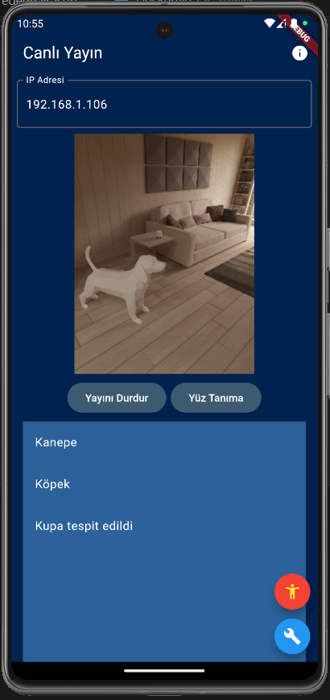

# Mobile-App-For-Visually-Impaired-People

This project is a mobile application designed for visually impaired people. The application analyzes camera images to detect objects and people and communicates this information to the user audibly.

## Logic and One More Thing
The Flutter application sends the video captured from the camera to the specified IP address at 2 frames per second. On the configured Python server, YOLO and face_recognition are run on the frames. The detected objects and people are sent back from the server to the application, and an audible output is provided to the user. Admin access is required for using Firestore, and since I couldn't include that file, it is not working at the moment. If anyone is interested, they can contact me.

### Login Screen

Users can log in using their email and password. There is also an option to reset the password if they forget it.

### Face Recognition Registration Screen

In this screen, the user can register the face data of a person they want to be recognized. After entering the IP address, they can submit the face data by entering the name of the person.

### Live Stream Screen

During the live stream, detected objects and people are listed. Users can stop the stream or start the face recognition process.

## Functionality

The mobile application uses a YOLO (You Only Look Once) model for object detection and a face recognition system to identify people. Key features include:

- **Object Detection**: The application detects various objects in the camera's field of view and communicates these detections to the user audibly.
- **Face Recognition**: Users can register faces and names, allowing the application to recognize and identify individuals during the live stream.
- **Live Streaming**: The application provides a live video feed where detected objects and identified people are displayed in real-time.
- **Voice Feedback**: All detected objects and identified individuals are communicated to the user through voice feedback, ensuring accessibility for visually impaired users.
